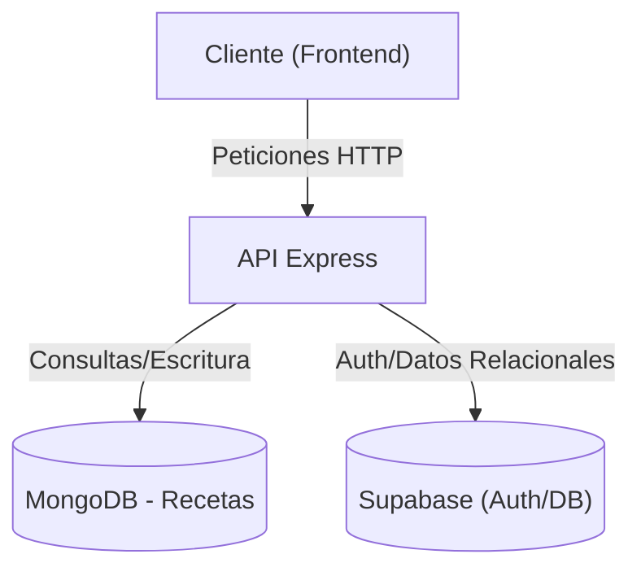

# SuperRecetario Backend

Este es el servicio backend para la aplicación SuperRecetario. Proporciona una API RESTful para gestionar recetas, autenticación de usuarios, comentarios y favoritos.

## Arquitectura

El backend utiliza una **arquitectura híbrida** de base de datos para aprovechar las fortalezas de diferentes tecnologías:

1.  **MongoDB (vía Mongoose)**: Se utiliza como la base de datos principal para almacenar la información de las **Recetas**. Esto permite un esquema flexible para los ingredientes, instrucciones y metadatos de las recetas.
2.  **Supabase (PostgreSQL)**: Se utiliza para la **Autenticación**, gestión de **Usuarios**, **Comentarios** y **Favoritos**. Supabase proporciona una capa robusta de seguridad y gestión de usuarios lista para usar.

### Diagrama de Flujo de Datos Simplificado



## Stack Tecnológico

- **Runtime**: Node.js
- **Framework**: Express.js
- **Base de Datos 1**: MongoDB (con Mongoose ODM)
- **Base de Datos 2**: Supabase (PostgreSQL)
- **Autenticación**: JWT (JSON Web Tokens) y Supabase Auth
- **Otros**: `dotenv` para variables de entorno, `cors` para seguridad.

## Estructura del Proyecto

- `src/server.js`: Punto de entrada de la aplicación. Configura Express y conecta las bases de datos.
- `src/config/`: Archivos de configuración (ej. conexión a MongoDB).
- `src/models/`: Modelos de Mongoose (ej. `recipeModel.js`).
- `src/routes/`: Definición de las rutas de la API.
  - `recipesRoutes.js`: CRUD de recetas.
  - `authRoutes.js`: Registro y login de usuarios.
  - `commentsRoutes.js`: Gestión de comentarios en recetas.
  - `favoritesRoutes.js`: Gestión de recetas favoritas.
  - `rdfRoutes.js`: Exportación de datos en formato RDF (Linked Data).

## Endpoints Principales

### Recetas (`/api/recipes`)

- `GET /`: Obtener todas las recetas.
- `GET /:id`: Obtener una receta por ID.
- `POST /`: Crear una nueva receta.
- `PUT /:id`: Actualizar una receta (reemplazo).
- `PATCH /:id`: Actualizar parcialmente una receta.
- `DELETE /:id`: Eliminar una receta.

### Autenticación (`/api/auth`)

- `POST /register`: Registrar un nuevo usuario.
- `POST /login`: Iniciar sesión.

### Comentarios (`/api/comments`)

- `GET /:recipeId`: Obtener comentarios de una receta.
- `POST /:recipeId`: Agregar un comentario.
- `DELETE /:commentId`: Eliminar un comentario.

### Favoritos (`/api/favorites`)

- `GET /:userId`: Obtener favoritos de un usuario.
- `PUT /:userId`: Agregar receta a favoritos.
- `DELETE /:userId`: Eliminar receta de favoritos.

### Linked Data (`/rdf`)

- `GET /:id`: Obtener representación RDF/XML de una receta.

## Configuración y Ejecución

1.  **Instalar dependencias**:

    ```bash
    npm install
    ```

2.  **Variables de Entorno**:
    Asegúrate de tener un archivo `.env` en la raíz con las siguientes variables:

    ```env
    MONGODB_URI=tu_uri_de_mongodb
    SUPABASE_URL=tu_url_de_supabase
    SUPABASE_KEY=tu_key_de_supabase
    JWT_SECRET=tu_secreto_jwt
    PORT=3001
    ```

3.  **Ejecutar servidor**:
    ```bash
    npm start
    ```
    El servidor correrá por defecto en `http://localhost:3001`.
